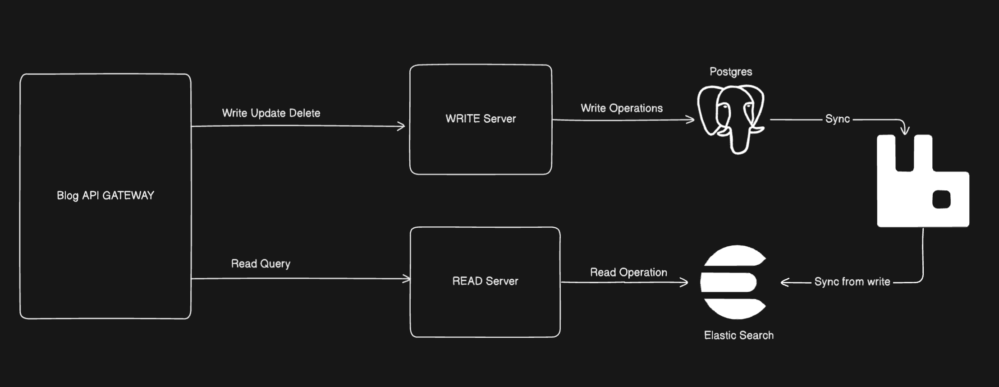

# 📝 Technical Blogging App (Under Development)

This is a backend service for a **Technical Blogging Platform**, built with **Go**, **PostgreSQL**, **RabbitMQ**, and **Elasticsearch**.  
It follows a **CQRS (Command Query Responsibility Segregation)** style architecture to handle **read** and **write** operations efficiently.  

---

## 🚀 Architecture

The system is designed to separate **write operations** (create, update, delete blogs) and **read operations** (fetch/search blogs).  



- **Blog API Gateway**  
  Entry point for all requests.

- **Write Server**  
  Handles `Create`, `Update`, and `Delete` requests.  
  Stores data in **PostgreSQL** and syncs changes through **RabbitMQ**.

- **Read Server**  
  Handles `Read` requests.  
  Fetches data from **Elasticsearch** for fast querying and searching.

- **PostgreSQL**  
  Primary database for reliable write operations.

- **RabbitMQ**  
  Message broker to sync updates between PostgreSQL and Elasticsearch.

- **Elasticsearch**  
  Optimized for search and fast reads.

---

## 📦 Tech Stack

- **Language:** Go (Golang)  
- **Database:** PostgreSQL  
- **Search Engine:** Elasticsearch  
- **Message Broker:** RabbitMQ  
- **Containerization:** Docker & Docker Compose  

---

## 🛠️ Request Body Example

When creating a blog post, the API accepts JSON like this:

```json
{
  "title": "My First Blog",
  "description": "This is a sample blog post to test the API.",
  "content": "Here is some detailed content of the blog post...",
  "tags": ["general", "introduction", "go"],
  "metadata": {
    "likes": 0,
    "category": "General"
  }
}
```
## 🐳 Running with Docker Compose

> ⚠️ **Note:** This project is still in development phase.

### Clone the repository

```bash
git clone https://github.com/SLANGERES/blogging-app.git
cd blogging-app
```
## 📌 Development Status
```
 Project setup with Docker Compose

 Basic API Gateway implementation

 Write server (CRUD APIs)

 PostgreSQL schema setup

 RabbitMQ integration

 Elasticsearch read server
```